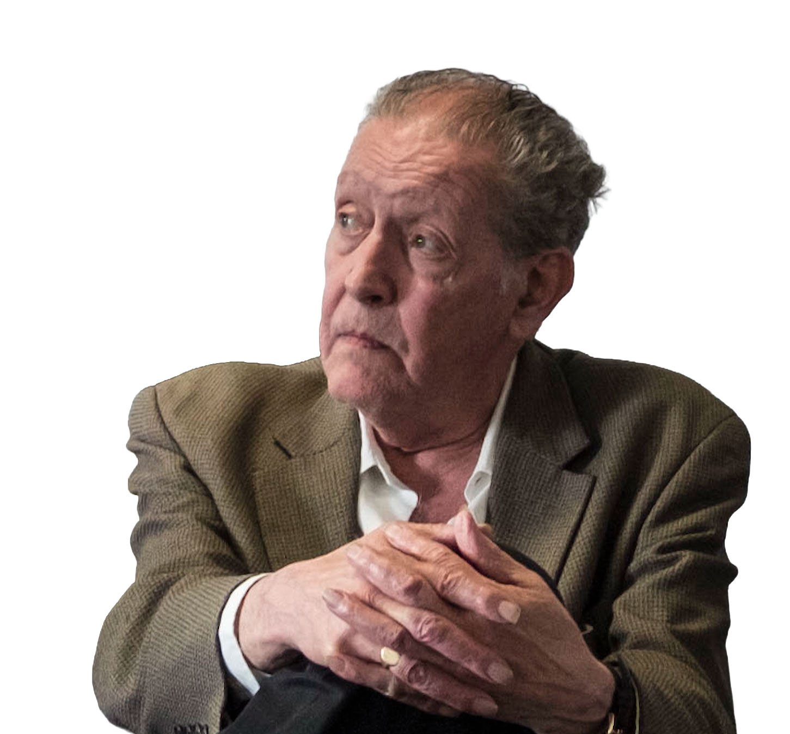

---

---
title: "Jeff Coulter"
---

{fig-alt="Jeff Coulter" width="380"}

Jeff Coulter's work has been central to the development of ethnomethodological approaches to language, mind, practical reasoning, and social action.

This collection currently contains materials from the 1987 seminar series **Wittgenstein and Ethnomethodology**, held at the Department of Sociology at Boston University.

## Wittgenstein and Ethnomethodology, 1987

The seminar met during the spring and fall of 1987. It was organized around Ludwig Wittgenstein's later philosophy and its relationship to ethnomethodology, while also addressing broader questions concerning language, mind, rules, social action, and the philosophy of the social sciences.

Nineteen meetings were held between January and October 1987. Fifteen of these meetings were transcribed.

[**Introduction to the seminar series**](pdfs/coulter-1987/intro.pdf){target="_blank"}

### Seminar meetings

[**Meeting 1 — 15 January 1987**](pdfs/coulter-1987/meeting-01.pdf){target="_blank"}
Organizational meeting and introduction to Wittgenstein and ethnomethodology.

[**Meeting 2 — 22 January 1987**](pdfs/coulter-1987/meeting-02.pdf){target="_blank"}
The *Blue Book*: logic, language, meaning, and definition.

[**Meeting 3 — 29 January 1987**](pdfs/coulter-1987/meeting-03.pdf){target="_blank"}
Meaning as use, context, grammar, forms of life, rules, and intending.

[**Meeting 4 — 5 February 1987**](pdfs/coulter-1987/meeting-04.pdf){target="_blank"}
Cartesian mentalism, depth and surface grammar, understanding, remembering, belief, and knowledge.

[**Meeting 5 — 12 February 1987**](pdfs/coulter-1987/meeting-05.pdf){target="_blank"}
The private language argument.

[**Meeting 6 — 19 February 1987**](pdfs/coulter-1987/meeting-06.pdf){target="_blank"}
Rules, forms of life, the conceptual and the empirical, and criteria.

**Meeting 7 — 5 March 1987**
Not transcribed.

[**Meeting 8 — 19 March 1987**](pdfs/coulter-1987/meeting-08.pdf){target="_blank"}
"The same," pain, criteria, rule-following, private language, grammar, and nature.

[**Meeting 9 — 2 April 1987**](pdfs/coulter-1987/meeting-09.pdf){target="_blank"}
Thought and thinking.

[**Meeting 10 — 9 April 1987**](pdfs/coulter-1987/meeting-10.pdf){target="_blank"}
Will and willing.

[**Meeting 11 — 16 April 1987**](pdfs/coulter-1987/meeting-11.pdf){target="_blank"}
Criteria.

[**Meeting 12 — 23 April 1987**](pdfs/coulter-1987/meeting-12.pdf){target="_blank"}
Criteria, continued: symptoms, evidence, defeasibility, *On Certainty*, and skepticism.

**Meeting 13 — 30 April 1987**
Not transcribed.

**Meeting 14 — 10 September 1987**
Organizational meeting; not recorded.

[**Meeting 15 — 17 September 1987**](pdfs/coulter-1987/meeting-15.pdf){target="_blank"}
The grammatical/logical version of ethnomethodology.

[**Meeting 16 — 24 September 1987**](pdfs/coulter-1987/meeting-16.pdf){target="_blank"}
The grammatical/logical version of ethnomethodology, continued, including sequential organization and speech act theory.

[**Meeting 17 — 1 October 1987**](pdfs/coulter-1987/meeting-17.pdf){target="_blank"}
Discussion meeting: grammatical/logical and empiricist approaches to practical action; Garfinkel, Sacks, and Wittgenstein.

[**Meeting 18 — 8 October 1987**](pdfs/coulter-1987/meeting-18.pdf){target="_blank"}
Warranting the interactional relevance of categorizations.

**Meeting 19 — 15 October 1987**
Not transcribed.

## About the transcribed lectures

The transcribed lectures were prepared as edited records of informal seminar meetings. The original documents state that they should not be quoted without permission from the parties involved.

Further information about provenance and permissions will be added to the archive.
